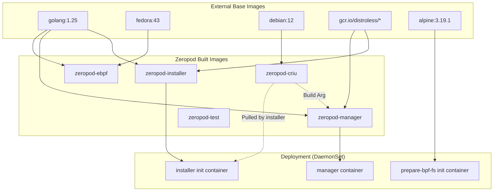

# ASCII Block Diagram of Zeropod Images, Containers & Dependencies

## Image Build Hierarchy

The following diagram shows the build-time and runtime dependencies between images:



## Build vs. Deployment Encapsulation

The build and deployment processes are strictly separated using **upfront builds** and **Kustomize-based deployment**:

### 1. Upfront Image Builds
All Zeropod-specific images are built and pushed to a registry (e.g., `ghcr.io/ctrox`) before any deployment occurs:
- **`zeropod-criu`**: Contains CRIU binaries/libs.
- **`zeropod-installer`**: Contains the installer binary and the Zeropod shim.
- **`zeropod-manager`**: Contains the manager binary and CRIU binaries (copied from the CRIU image during build).
- **`zeropod-ebpf`**: Build-time utility for BPF generation.

### 2. Deployment Encapsulation (Kustomize)
The deployment manifests in `config/` use placeholders (like `image: installer`) which are replaced by Kustomize at deployment time:
- **Image Mapping**: `config/production/kustomization.yaml` maps the local names to the full registry paths and tags (e.g., `ghcr.io/ctrox/zeropod-installer:v0.9.1`).
- **Encapsulation**: The Kubernetes cluster only sees the final images. No build tools (Go, Clang, etc.) are required on the target nodes.
- **Runtime Dependency Injection**: The `zeropod-criu` image is passed as an argument (`-criu-image`) to the installer via Kustomize patches. This allows the installer to pull the exact version of CRIU it needs from the registry at runtime.

> [!IMPORTANT]
> While most components are encapsulated in the images, the **installer container** performs a runtime pull of the `zeropod-criu` image using the node's container runtime to perform the host-level installation of CRIU.


**Legend**:
- **Base Images**: Official images pulled from Docker Hub or GCR.
- **Dockerfiles**: Define how each image is built.
- **Makefile Targets**: Commands that build/push images and run containers.
- **Images Built**: Final images produced by the build process.
- **Runtime Containers**: Containers instantiated during development/CI (Kind workers, test containers, EBPF generation).
- **Deployed Pods**: The installer and manager images run as pods in a Kind cluster.
- **External Registry**: All images are pushed to `ghcr.io/ctrox`.
```

## DaemonSet Details

The Zeropod node DaemonSet runs on every node and consists of two containers:

| Container | Image (reference) | Built image | Registry |
|-----------|-------------------|------------|----------|
| installer (init) | `installer` | `ghcr.io/ctrox/zeropod-installer:dev` | ghcr.io/ctrox |
| manager | `manager` | `ghcr.io/ctrox/zeropod-manager:dev` | ghcr.io/ctrox |

Additional images used by the DaemonSet (pulled from public registries):

- `alpine:3.19.1` – used by the `prepare-bpf-fs` init container.

## DaemonSet Images

The Zeropod DaemonSet runs two primary containers and one init helper:

| Container | Image reference in manifest | Built image (registry) |
|-----------|----------------------------|------------------------|
| **installer** (init) | `installer` | `ghcr.io/ctrox/zeropod-installer:dev` |
| **prepare‑bpf‑fs** (init) | `alpine:3.19.1` (public Docker Hub) | — (public image) |
| **manager** (main) | `manager` | `ghcr.io/ctrox/zeropod-manager:dev` |

These images are pulled by the DaemonSet on each node. The installer and manager images are built and pushed by the repository (see the Makefile targets). The `prepare‑bpf‑fs` container uses the official Alpine image to mount the BPF filesystem before the manager starts.

## DaemonSet Container Lifecycle

- **installer** (init) – runs once when the pod starts, prepares the host filesystem and then exits.
- **prepare-bpf-fs** (init) – runs after the installer, mounts the BPF filesystem if needed, then exits.
- **manager** (main) – starts after both init containers succeed and runs continuously, managing Zeropod on the node.

If the manager crashes, Kubernetes restarts only the manager container; the init containers are not re‑run unless the pod is recreated.

## Installer & `prepare-bpf-fs` Container Responsibilities

**installer (init)**
- Runs **once** when the DaemonSet pod starts.
- Performs the following actions (see `cmd/installer/main.go`):
  1. **Installs CRIU** binaries from the `zeropod-criu` image into the host opt path.
  2. **Installs the Zeropod runtime shim** (`containerd-shim-zeropod-v2`) into the host opt directory.
  3. **Configures containerd** to use the Zeropod runtime (adds an import and runtime definition to the containerd config, then restarts the appropriate containerd service).
  4. **Creates the `zeropod` RuntimeClass** in the Kubernetes API so pods can request the Zeropod runtime.
  5. **Loads a TLS CA certificate** from a Kubernetes secret (`ca-cert`) into `/tls/ca.crt` and `/tls/ca.key` for secure communication.
- After completing these steps, the installer exits, leaving the host prepared for the manager.

**prepare‑bpf‑fs (init)**
- Runs **after** the installer.
- Executes a shell command that checks whether the BPF filesystem is already mounted at `/sys/fs/bpf`; if not, it mounts it using `mount -t bpf bpf /sys/fs/bpf`.
- Runs in a privileged Alpine container with bidirectional mount propagation, ensuring the BPF mount is visible to the host and to the manager container.
- Exits once the mount is confirmed, allowing the manager to load eBPF programs.

These init containers set up the necessary kernel‑level services (CRIU for checkpoint/restore, the BPF filesystem for eBPF programs, and the container runtime shim) before the **manager** container takes over the node‑level orchestration duties.
