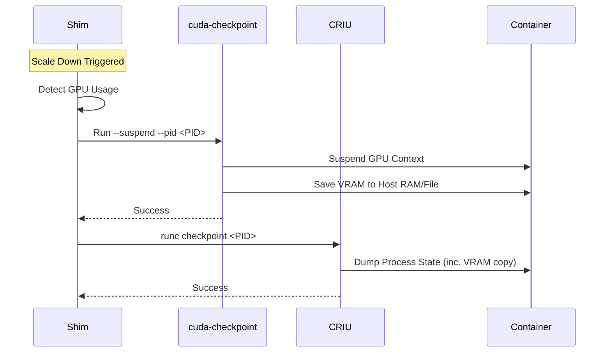

# CUDA Checkpointing Integration Plan

This document outlines the step-by-step plan to extend Zeropod with support for suspending and resuming CUDA workloads (e.g., vLLM inference) using the `cuda-checkpoint` API (available in NVIDIA Driver 550+ / CUDA 13.x).

## Prerequisites

1.  **Host Requirements**:
    -   NVIDIA Driver >= 550.
    -   `cuda-checkpoint` binary installed and available in the system PATH (or a known location like `/usr/bin/cuda-checkpoint`).
    -   NVIDIA Container Toolkit configured.

2.  **Container Requirements**:
    -   Container must have access to NVIDIA GPUs (`nvidia.com/gpu` resource).

## Architectural Decision: CLI vs Direct API

**Recommendation**: Use the `cuda-checkpoint` CLI utility.

**Rationale**:
-   **No Go Bindings**: The CUDA Driver Checkpoint API (`cuCheckpointProcessCheckpoint`) has no stable Go bindings. Implementing `cgo` wrappers is complex and introduces ABI compatibility risks.
-   **Complexity Management**: The CLI utility handles critical safety steps like "Locking -> Draining -> Checkpointing -> Unlocking" that would otherwise need to be re-implemented in Go.
-   **Stability**: Shelling out to a vendor-provided tool isolates the Zeropod Shim process from driver-level crashes or hangs.

## Architecture

The integration relies on `cuda-checkpoint` handling the GPU state serialization *before* the CRIU dump occurs.

## Step-by-Step Implementation

### Phase 1: Environment Preparation (`zeropod-installer`)

**Goal**: Ensure `cuda-checkpoint` is available to the Shim.

1.  **Host Verification**: The `installer` should check for the existence of `/usr/bin/cuda-checkpoint` (or equivalent).
2.  **Mounting (Optional)**: If `cuda-checkpoint` needs to be injected, the installer could mount it, but ideally, it should be present on the GPU node host.

### Phase 2: Shim Modifications (`shim/checkpoint.go`)

**Goal**: Suspend the GPU context before checkpointing.

1.  **PID Discovery**:
    -   Since `cuda-checkpoint` acts on a single PID, we must identify all PIDs in the container.
    -   Use the container's **Cgroup** to list all PIDs (`/sys/fs/cgroup/.../cgroup.procs`).
    -   Iterate over these PIDs.
2.  **Suspending**:
    -   For each PID in the cgroup:
        -   Execute: `cuda-checkpoint --suspend --pid <PID> --root-dir <WorkDir>`.
        -   (Optional optimization: Check if PID uses GPU via `nvidia-smi` before calling).
    -   If any fails, rollback (resume already suspended ones) and abort.
3.  **Pre-Checkpoint Hook**:
    -   In `func (c *Container) checkpoint(...)`:
    -   Run the suspension logic *before* calling `runc.Checkpoint`.

### Phase 3: Shim Modifications (`shim/restore.go`)

**Goal**: Ensure GPU context is resumed.

1.  **Restore Logic**:
    -   Standard `runc restore` should restore the process memory.
    -   Since `cuda-checkpoint` serializes GPU state into the process address space (or files tracked by the process), CRIU *should* restore it automatically.
    -   **Validation**: Verify if an explicit `cuda-checkpoint --resume` is needed post-restore. (Documentation suggests integration with CRIU might be automatic if using the specific plugin, but standalone use might require a resume hook).

### Phase 4: Validation with vLLM

1.  **Test Case**:
    -   Run a vLLM container serving a model.
    -   Send requests.
    -   Wait for scale-down.
    -   Trigger scale-up.
    -   Send new requests and verify the model is still loaded on GPU (no re-initialization).

## Known Challenges

-   **Memory Overhead**: Saving VRAM to system RAM increases the checkpoint image size significantly.
-   **Driver Version**: Strict dependency on host driver version.
